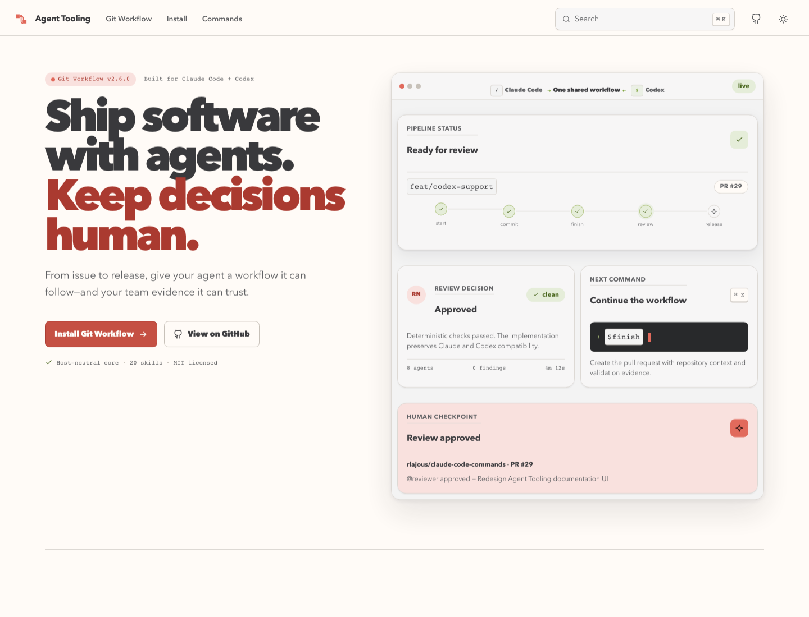
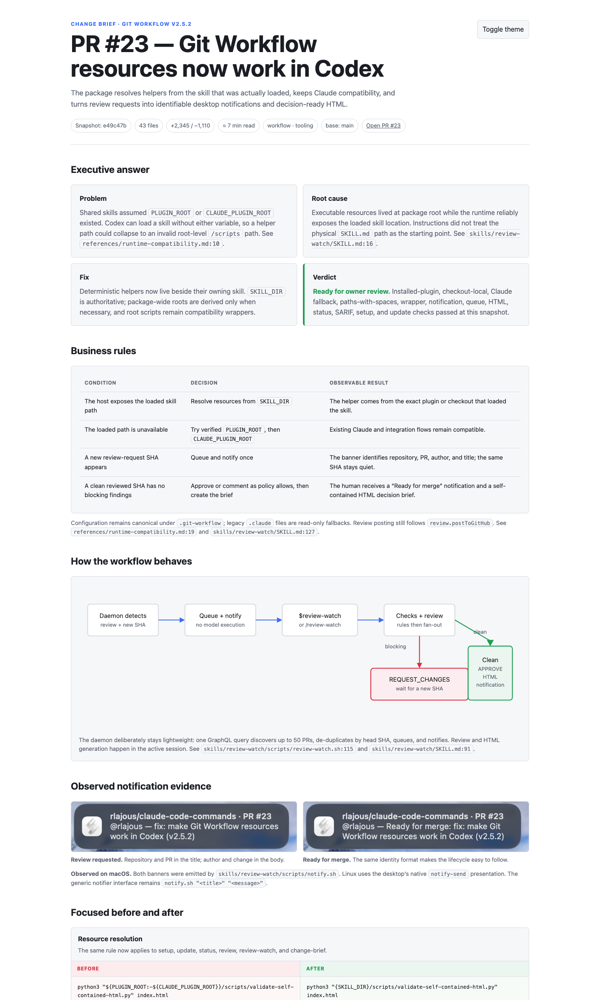

# Git Workflow

An agent-neutral package of 21 skills, eight specialized agents, and opt-in hooks for Git, pull requests, releases, QA, and desktop notifications. The same repository supports Claude Code and Codex without maintaining two copies of the workflows.

[Documentation](https://agents.navarrolajous.com/) · [Installation](https://agents.navarrolajous.com/git-workflow/installation/) · [Contributing](https://agents.navarrolajous.com/git-workflow/contributing/) · [Latest release](https://github.com/rlajous/claude-code-commands/releases/latest)

[](https://agents.navarrolajous.com/)

## What it includes

- Framework-agnostic branch, commit, PR, release, QA, RFC, and status workflows
- Linear, Jira, and GitHub issue integration through the host's MCP configuration
- Native Claude plugin packaging and a native Codex plugin manifest
- Eight review, release, version-research, and QA agents
- Canonical runtime-neutral configuration and state in `.git-workflow/`
- Backward-compatible reads from legacy `.claude/` state
- An opt-in review hook for new commits and pushes, with host-specific delivery
- Opt-in local alerts for main-agent completion and new reviews on your pull requests

## Install for Claude Code

The existing marketplace installation remains supported:

```text
/plugin marketplace add rlajous/claude-code-commands
/plugin install git-workflow@git-workflow-marketplace
```

Skills installed from the marketplace use the package prefix, for example:

```text
/git-workflow:start PROJ-123
/git-workflow:commit
/git-workflow:finish
```

For unprefixed project skills, copy `skills/` to `.claude/skills/`, `agents/` to `.claude/agents/`, and the shared `references/` directory to `.claude/references/`.

## Install for Codex

Install or load this repository as a Codex plugin. Its `.codex-plugin/plugin.json` exposes all 21 directories under `skills/`. Then run the setup skill in the target project:

```text
$setup
```

Codex plugins distribute skills and hooks, while named project agents are discovered from `.codex/agents/`. `$setup` installs the eight generated agent definitions there. It shows a diff and asks before replacing a customized file; pass `--force` only when replacement is intentional.

Use `$setup --host codex`, `$setup --host both`, or `$setup --dry-run` to make host selection and preview behavior explicit.

During local plugin development, this repository can be loaded from a checkout with Codex's plugin installation/development workflow. No marketplace or universal-directory mutation is performed by this package.

For checkout-local development, Codex also discovers the same 21 skills through the committed
`.agents/skills -> ../skills` symlink. Use either the installed plugin or checkout-local discovery
in a session, not both, because duplicate skill names appear as separate entries.

## Configure

Run `/git-workflow:setup` for a Claude marketplace install, `/setup` for a manual Claude project copy, or `$setup` in Codex. New projects use:

```text
.git-workflow/
├── config.yaml
└── version.json
```

Generated local state—`pr-context.json`, `status.html`, hook opt-in settings, and the reviewed-SHA ledger—also lives under `.git-workflow/` and is ignored where appropriate. Setup imports legacy values from `.claude/` without deleting or silently overwriting the original files.

A minimal configuration is:

```yaml
workflow:
  type: staging
  developmentBranch: staging
  productionBranch: main

issueTracker:
  type: auto

attribution:
  enabled: false
  format: ""
```

See [CONFIGURATION.md](CONFIGURATION.md) and [INSTALLATION.md](INSTALLATION.md).

## Skills

Invoke a skill as `/name` in Claude and `$name` in Codex.

| Skill | Purpose |
| --- | --- |
| `setup` | Configure the workflow and install project agents |
| `update` | Safely synchronize skills, agents, templates, and metadata |
| `start` | Create a feature branch from a ticket |
| `plan-tdd` | Design a reviewed TDD plan (HTML + YAML) before writing code |
| `tdd` | Implement a ticket test-first |
| `commit` | Create a formatted commit |
| `finish` | Push and open a pull request |
| `review` | Fan out a comprehensive PR review |
| `review-watch` | Auto-review PRs that request your review, in a loop (linters + fan-out; REQUEST_CHANGES / APPROVE) |
| `notifications` | Diagnose and run opt-in main-agent and authored-PR activity notifications |
| `change-brief` | Generate a sub-10-minute HTML decision brief with business logic and contextual evidence |
| `release` | Prepare and validate a release |
| `release-notes` | Generate release notes |
| `sync` | Back-merge production into development |
| `plan-qa` | Generate a QA plan |
| `start-qa` | Execute a QA plan |
| `rfc` | Create an RFC |
| `review-request` | Draft a review request |
| `standup` | Summarize recent work |
| `status` | Show workflow state and next action |
| `clean-gone` | Remove gone branches and linked worktrees safely |

Detailed examples are in [COMMANDS.md](COMMANDS.md).

### Unified notifications

Agent completion and GitHub review activity use one opt-in notification system. The packaged
`Stop` hook announces only the main Claude Code or Codex turn; one daemon shared with Review Watch
announces new approvals, requested changes, and review feedback on PRs you authored.

```yaml
notifications:
  agentComplete: true
  prActivity: true
  sound: Glass
```

```text
/notifications --doctor          # Claude Code
/notifications --daemon-command
$notifications --doctor          # Codex
$notifications --daemon-command
```

The first PR-activity run establishes a silent baseline. Later events deduplicate by GitHub review
ID, while completion alerts deduplicate by host, session, and turn without storing the assistant's
full message. Read the [Notifications guide](docs/NOTIFICATIONS.md) for installation modes, exact
formats, privacy, local state, and troubleshooting.

### Review watcher (console)

Ask the skill for an absolute, copy-paste-safe command, then run it in a spare terminal to get
pinged (sound + desktop notification) when a PR requests your review. Notifications identify the
repository and PR in the title (`owner/repo · PR #42`) and the author plus PR title in the message
(`@alice — Fix login redirect`):

```text
/review-watch --daemon-command   # Claude Code
$review-watch --daemon-command   # Codex
```

Run `/review-watch --doctor` in Claude or `$review-watch --doctor` in Codex to check paths,
dependencies, configuration, and GitHub authentication without publishing a review. When the
daemon beeps, use `/review-watch <pr-url>` in Claude or `$review-watch <pr-url>` in Codex (or the
matching `--drain` form). It runs the project linters and its bundled known-issues ruleset first,
escalates to the full review fan-out only if those pass, posts `REQUEST_CHANGES` on problems, and
on a clean PR posts `APPROVE`, generates a `change-brief` with diagrams, UI/mobile screenshots, or
API cURL evidence when relevant, and pings you. Opt in with
`reviewWatch.enabled: true` in `.git-workflow/config.yaml`.

### What it looks like

Unified notifications identify the repository and host or pull request before the event itself:


The sequence is assembled from three real Notification Center captures and plays once in under five
seconds. The [Notifications guide](docs/NOTIFICATIONS.md) keeps each original frame available for
closer inspection.

Linux uses the active desktop's native `notify-send` appearance. The daemon only discovers,
de-duplicates, queues, and notifies; the active Claude or Codex session performs the review.

A clean result produces one self-contained HTML decision brief designed for a 6–8 minute read. It
combines business rules, a diagram when the flow benefits from one, contextual screenshots or API
cURL evidence, focused before/after code, risks, rollout, rollback, and verification.

[](docs/examples/change-brief-pr-23.html)

[Open the HTML example](docs/examples/change-brief-pr-23.html), read the complete
[Review Watch guide](docs/REVIEW_WATCH.md), or see the [Change Brief guide](docs/CHANGE_BRIEF.md).

## Agents and delegation

The canonical instructions live in `agents/*.md`; generated Codex definitions live in `.codex/agents/*.toml`.

- `review` starts the specialized review agents in parallel and waits for all findings.
- `release` uses `release-validator` and uses `version-delta-analyst` when a dependency, framework, or API version changed.
- `start-qa` delegates sufficiently large plans to `qa-executor`.
- Routine edits remain in the main session.

Read the complete catalog in [docs/SUBAGENTS.md](docs/SUBAGENTS.md).

## Commit-review hook

The hook is disabled by default. Enable it in the target project:

```yaml
# .git-workflow/git-workflow.local.md
review-on-commit: true
```

Claude registers `hooks/claude-hooks.json`; Codex discovers `hooks/hooks.json`. Both invoke the same script. It reacts only to `git commit` and `git push`, suppresses duplicate SHAs, and returns host-appropriate output. See [HOOKS.md](HOOKS.md).

## Updating safely

Use `/update` or `$update`. By default it previews differences and requires confirmation before overwriting a locally customized skill or agent.

```text
$update --dry-run
$update --source ../git-workflow
$update --source https://github.com/rlajous/claude-code-commands.git
$update --host both
$update --prune
$update --force
```

## Development

Community contributions are welcome. Read [CONTRIBUTING.md](CONTRIBUTING.md) before changing shared skills, agents, hooks, packaging, or the documentation site.

After changing a canonical agent, regenerate the committed Codex definitions:

```bash
node scripts/generate-codex-agents.mjs
node scripts/generate-codex-agents.mjs --check
```

Run all repository checks with:

```bash
bash scripts/validate.sh
```

The Claude and Codex manifests, skill/agent parity, TOML syntax, generated-file drift, and hook behavior are validated in CI.

## License

MIT. See [LICENSE](LICENSE).
