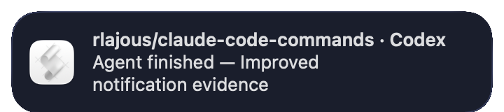
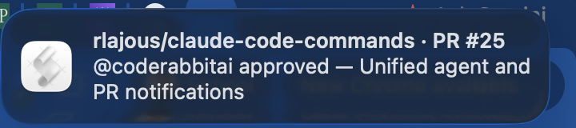
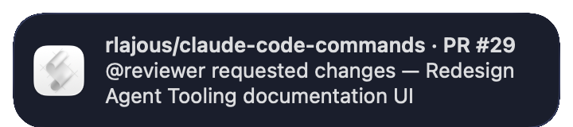
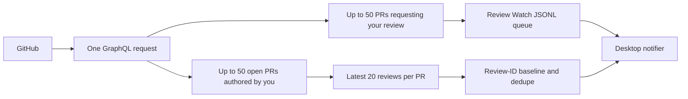

# Notifications

Git Workflow can send local desktop notifications when the main Claude Code or Codex turn ends and
when someone submits a review on an open pull request you authored. Every channel is opt-in. The
feature never changes a pull request, posts a review, or modifies global host configuration.

## Quick start

Add the channels you want to `.git-workflow/config.yaml`:

```yaml
notifications:
  agentComplete: true
  prActivity: true
  sound: Glass
```

Check the installation without sending a notification or querying pull requests:

```text
/notifications --doctor   # Claude Code
$notifications --doctor   # Codex
```

Agent-complete alerts use the packaged `Stop` hook. PR activity needs the shared background daemon.
Print its absolute command, then paste that command into another terminal:

```text
/notifications --daemon-command   # Claude Code
$notifications --daemon-command   # Codex
```

The compatibility forms `/review-watch --doctor`, `$review-watch --doctor`, and their
`--daemon-command` variants resolve to the same diagnostics and daemon.

## Events and exact format

Only the main agent turn produces a completion alert:

```text
owner/repo · Codex
Agent finished — Implemented review activity notifications
```

Claude uses `Claude Code` in the title. The summary is the first useful line of
`last_assistant_message`, with Markdown prefixes removed and a 160-character limit. An empty
summary produces `Agent finished`. Subagents and agent errors are not notification events in
v2.6.0. Claude completion is also deferred while the hook payload reports background tasks or
session crons.

The daemon reports submitted GitHub reviews on open pull requests authored by the authenticated
user:

```text
owner/repo · PR #42
@alice approved — Fix login redirect

owner/repo · PR #42
@alice requested changes — Fix login redirect

owner/repo · PR #42
@alice left review feedback — Fix login redirect
```

`APPROVED`, `CHANGES_REQUESTED`, and `COMMENTED` are supported. A review with several inline
comments still produces one notification because deduplication uses the review node ID. Deleted
accounts appear as `unknown reviewer`. Reviews submitted by the authenticated user are ignored.
General PR comments, issue comments, CI status, merges, commits, dismissed reviews, agent failures,
and mobile push notifications are outside v2.6.0.

## What it looks like

These banners were emitted by the packaged macOS notifier. They show the exact identity and message
formats used by v2.6.0; Linux presents the same text through the active desktop's `notify-send`
theme.

**Main Codex turn completed**



**A reviewer approved an authored pull request**



**A reviewer requested changes**



The repository includes a reproducible way to refresh these screenshots on a clean remote Mac: the
[`Capture macOS notification evidence`](https://github.com/rlajous/claude-code-commands/actions/workflows/capture-macos-notifications.yml)
workflow. It calls the same packaged notifier used at runtime, captures the real Notification
Center windows against a deterministic background, and uploads both the banners and full-screen
diagnostics. No personal desktop, open application, or fabricated browser mockup is involved.

The workflow targets a dedicated self-hosted runner labeled `macOS` and `notification-capture`.
GitHub-hosted macOS images are not suitable for this evidence: they expose a graphical desktop but
do not load the per-user Notification Center LaunchAgent required to render banners. A dedicated
remote Mac keeps the capture real while isolating it from a contributor's personal computer.

## One daemon, two GitHub channels

The notifications skill owns one daemon shared with [Review Watch](REVIEW_WATCH.md):



The two GraphQL searches are optional aliases in the same request. `--repo owner/name` applies to
both. `reviewWatch.enabled` controls review-request discovery; `notifications.prActivity` controls
authored-PR review discovery. Enabling both does not create duplicate polling.

The first run with `prActivity: true` records all visible existing reviews as a baseline and sends
no PR-activity banners. Only review IDs first observed after that baseline notify. GitHub results
are limited to 50 open PRs in each enabled search and the latest 20 reviews per authored PR.

Daemon-only options are:

```text
--interval <seconds>   Override reviewWatch.intervalSeconds
--once                 Poll once and exit
--repo owner/name      Limit both searches to one repository
--force                Force review-request polling only
--show-config          Print resolved configuration and exit
```

## Hooks and installation modes

Installed plugins load host-specific descriptors that call the same adapter:

| Host | Registration | Invocation |
| --- | --- | --- |
| Claude Code plugin | `hooks/claude-hooks.json` | `agent-complete.py --host claude` |
| Codex plugin | `hooks/hooks.json` | `agent-complete.py --host codex` |
| Codex source checkout | `.codex/hooks.json` | Project-local adapter path |

No setup command writes `~/.claude`, `~/.codex`, or another global configuration file. For a
manual installation that does not load plugin hooks, copy the matching `Stop` entry into the
host's project hook configuration and change the command to the absolute installed
`skills/notifications/scripts/agent-complete.py` path. Merge it with existing hooks rather than
replacing the entire file.

Claude project registration in `.claude/settings.json`:

```json
{
  "hooks": {
    "Stop": [
      {
        "hooks": [
          {
            "type": "command",
            "command": "python3 \"/absolute/path/to/skills/notifications/scripts/agent-complete.py\" --host claude",
            "timeout": 10
          }
        ]
      }
    ]
  }
}
```

Codex project registration in `.codex/hooks.json` uses the same structure with `--host codex`.
The committed checkout registration resolves its adapter from `git rev-parse --show-toplevel` so
it remains valid when the checkout moves.

Restart the host after changing hook registration. Use either an installed Codex plugin or
checkout-local skill discovery in one session, not both, to avoid duplicate skill entries;
concurrent hook deduplication still prevents duplicate completion banners if two equivalent Stop
registrations run.

## State, deduplication, and privacy

Generated state is user-local and outside the repository:

```text
${XDG_STATE_HOME:-$HOME/.local/state}/git-workflow/
├── agent-complete-seen      # newest 500 host/session/turn digests
├── pr-activity-seen         # newest 2,000 GitHub review node IDs
├── review-watch-seen        # newest 500 repo/PR/head-SHA keys
└── review-watch-queue.jsonl # pending review requests
```

The completion ledger stores a SHA-256 digest, not the assistant message. When a host omits a turn
ID, the adapter prefers transcript path metadata without reading the transcript, then falls back to
the normalized message identity. The notifier receives only the repository label and first line.
The PR daemon stores public PR metadata needed
by Review Watch plus GitHub review IDs; it does not store review bodies or inline comments. State
files are bounded and can be removed to reset deduplication. Removing `pr-activity-seen` causes the
next run to establish a new silent baseline.

## Configuration reference

| Setting | Default | Purpose |
| --- | --- | --- |
| `notifications.agentComplete` | `false` | Opt into main-turn completion alerts. |
| `notifications.prActivity` | `false` | Opt into new reviews on authored open PRs. |
| `notifications.sound` | `Glass` | macOS sound used by all Git Workflow banners. |
| `reviewWatch.enabled` | `false` | Opt into review-request discovery and queueing. |
| `reviewWatch.intervalSeconds` | `60` | Shared daemon poll interval. |

If `notifications.sound` is absent, the legacy `reviewWatch.sound` value remains a compatibility
fallback. Canonical configuration is `.git-workflow/config.yaml`; `.claude/config.yaml` is read
only when the canonical file is absent.

## Troubleshooting

- Run the host-correct `notifications --doctor`. It validates absolute resources, Bash, Python 3,
  Node, Git, `gh`, parsed configuration, hook descriptors, and `gh auth status` without polling.
- If agent completion is silent, confirm `notifications.agentComplete: true`, restart the host,
  and verify that the plugin or project `Stop` hook is loaded.
- If PR activity is silent, confirm `notifications.prActivity: true`, start the daemon, and remember
  that the first run is a silent baseline.
- If only one repository matters, add `--repo owner/name` to the printed daemon command.
- If macOS suppresses banners, allow notifications for the terminal or AppleScript host. On Linux,
  verify `notify-send` and the desktop notification service.
- If `unknown reviewer` appears, GitHub returned a null author, commonly for a deleted account.
- If a notification repeats, inspect whether GitHub created a new review node ID; a second review
  from the same person is intentionally a new event.

See [Installation](../INSTALLATION.md), [Commands](../COMMANDS.md),
[Configuration](../CONFIGURATION.md), and [Review Watch](REVIEW_WATCH.md).
