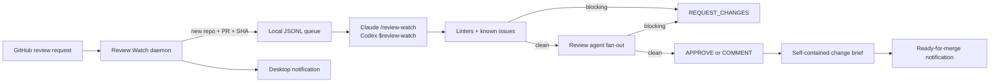
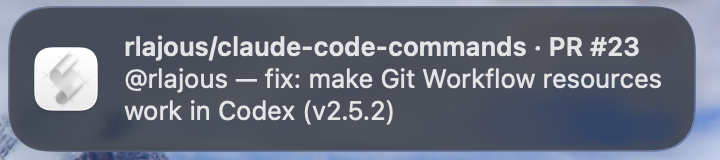
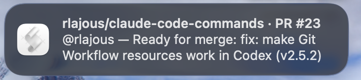

# Review Watch

Review Watch monitors pull requests that requested your review, notifies you when a new head SHA
appears, and lets the active Claude Code or Codex session review the queue until every PR is clean.
The background daemon is deliberately lightweight: it queries, de-duplicates, queues, and notifies;
it never runs the model or posts a GitHub review by itself.

## How it works



The daemon uses one GraphQL search for up to 50 open PRs with `review-requested:@me`. An optional
repository filter adds `repo:owner/name`. Each result includes repository, PR number, title, URL,
author, and `headRefOid`, so the same SHA is never announced twice.

## Quick start

Enable the opt-in setting in the project:

```yaml
reviewWatch:
  enabled: true
  intervalSeconds: 60
  sound: Glass
  linters: auto
  knownIssues: references/known-issues.md
```

Check the installation without querying PRs or changing GitHub:

```text
/review-watch --doctor   # Claude Code
$review-watch --doctor   # Codex
```

Ask the skill for the absolute daemon command:

```text
/review-watch --daemon-command   # Claude Code
$review-watch --daemon-command   # Codex
```

Paste the returned command into a spare terminal. The daemon polls until stopped with `Ctrl-C`.
The command can accept these daemon-only options:

```text
--interval <seconds>   Override the configured poll interval
--once                 Poll once and exit
--repo owner/name      Watch one repository
--force                Bypass the enabled gate for an intentional manual run
```

When a notification arrives, review one PR or drain the queue:

```text
/review-watch https://github.com/owner/repo/pull/42   # Claude Code
$review-watch https://github.com/owner/repo/pull/42   # Codex

/review-watch --drain
$review-watch --drain
```

Use `--comment-only` when the workflow must never post `REQUEST_CHANGES` or `APPROVE`:

```text
/review-watch 42 --comment-only
$review-watch 42 --comment-only
```

## Notifications

The title always identifies the repository and PR. The message identifies the author and change:

```text
owner/repo · PR #42
@alice — Fix login redirect
```

After a clean review, the same identity is preserved:

```text
owner/repo · PR #42
@alice — Ready for merge: Fix login redirect
```

If GitHub returns a deleted or missing author, the label is `unknown author` rather than an empty
handle.

| Review requested | Ready for merge |
| --- | --- |
|  |  |

These are real macOS banners emitted by the packaged notifier. Linux uses the active desktop's
native `notify-send` appearance. Sound is best effort; notification failure never fails a review.

## Review decisions

Review Watch uses two tiers:

1. Project linters and the configured known-issues ruleset catch deterministic blockers cheaply.
2. When Tier 1 is clean, the normal review agents inspect correctness, silent failures, types,
   tests, and comments as relevant to the diff.

Only findings with confidence of at least 80 survive aggregation. Blocking or high-severity
findings produce `REQUEST_CHANGES`; otherwise the event is `APPROVE`. Two safeguards can force a
non-blocking `COMMENT` instead:

- `--comment-only` was requested.
- The PR belongs to the authenticated GitHub user, because GitHub does not permit self-approval or
  self-requested changes.

Posting still follows `review.postToGitHub`:

| Value | Behavior |
| --- | --- |
| `ask` | Show the drafted review and request confirmation before posting. |
| `always` | Post the resolved event without another confirmation. |
| `never` | Keep the result local. |

When the result is clean, Review Watch generates a [Change Brief](CHANGE_BRIEF.md) and sends the
ready-for-merge notification even when safe mode or self-authorship changes the GitHub event to
`COMMENT`.

## State and compatibility

Daemon discovery state is user-local:

```text
${XDG_STATE_HOME:-$HOME/.local/state}/git-workflow/
├── review-watch-seen
└── review-watch-queue.jsonl
```

Each new queue record has this shape:

```json
{
  "repo": "owner/repo",
  "number": 42,
  "headRefOid": "abc123",
  "author": "alice",
  "title": "Fix login redirect",
  "url": "https://github.com/owner/repo/pull/42",
  "queuedAt": 1770000000
}
```

`author` may be `null`; older records without the field remain valid. Records without repository,
PR number, or head SHA are discarded. The seen ledger keeps the latest 500 keys in observation
order.

Completed review SHAs are project-local in `.git-workflow/.review-watch-reviewed`, with the legacy
`.claude/.review-watch-reviewed` file accepted as a read-only fallback. A new commit changes the
head SHA and makes the PR eligible for another review round.

## Configuration

| Setting | Default | Purpose |
| --- | --- | --- |
| `reviewWatch.enabled` | `false` | Explicitly opts the project into the daemon and worker flow. |
| `reviewWatch.intervalSeconds` | `60` | Poll interval used when the CLI does not override it. |
| `reviewWatch.sound` | `Glass` | macOS system sound name. |
| `reviewWatch.linters` | `auto` | Auto-detect project linters or run an explicit command. |
| `reviewWatch.knownIssues` | `references/known-issues.md` | Project or skill-local deterministic ruleset. |
| `review.postToGitHub` | `ask` | `ask`, `always`, or `never`. |
| `review.postEvent` | `auto` | Derive `REQUEST_CHANGES`/`APPROVE`, or force `comment`. |

Canonical configuration lives in `.git-workflow/config.yaml`; `.claude/config.yaml` is a legacy
read-only fallback. CLI interval and repository arguments take precedence over configuration.

## Testing and safety

- `--doctor` checks paths, Bash, Python, Node, Git, `gh`, authentication, and parsed configuration.
  It does not query PRs, publish reviews, or create queue state.
- Automated tests replace the notifier through the internal `REVIEW_WATCH_NOTIFY_SCRIPT` override,
  so validation never emits real desktop notifications.
- The live query asks GitHub only for metadata required to identify and de-duplicate PRs.
- Review posting uses the same permission and self-review guards as the regular review skill.

## Troubleshooting

- **Doctor reports missing files:** reload or reinstall the plugin; never substitute a root
  `/scripts` path.
- **No PRs appear:** verify `reviewWatch.enabled: true`, `gh auth status`, and that GitHub requested
  a review from the authenticated user.
- **No desktop banner:** allow notifications for the terminal/AppleScript host on macOS, or verify
  `notify-send` and the desktop notification service on Linux.
- **A PR is skipped:** drafts and already-reviewed head SHAs are intentionally ignored. Push a new
  commit to create a new SHA.
- **Duplicate skill names in Codex:** use either the installed plugin or checkout-local
  `.agents/skills` discovery in a session, not both.

See [Installation](../INSTALLATION.md), [Commands](../COMMANDS.md), and
[Configuration](../CONFIGURATION.md) for the package-wide reference.
