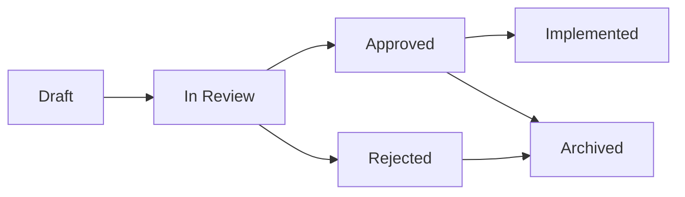

# RFC Best Practices

Guidelines for writing and reviewing RFCs in this repository.

## When to Write an RFC

Write an RFC when proposing:

- **New slash command** - Adding a command to `.claude/commands/`
- **Config schema change** - Adding or modifying `.claude/config.yaml` fields
- **Workflow change** - Altering the `/start -> /commit -> /finish` flow
- **Breaking change** - Modifying existing command behavior
- **New agent type** - Adding an agent to `.claude/agents/`
- **New integration type** - Supporting a new issue tracker or package manager
- **Cross-command behavior change** - Modifying `.pr-context.json` format or shared conventions
- **Template structure change** - Modifying frontmatter fields or template format

### When a PR Suffices

No RFC needed for:

- Typo fixes and wording improvements
- Documentation improvements or clarifications
- Adding examples to `examples/`
- Dependency bumps
- Single-command bug fixes that don't change behavior
- Adding comments or improving readability

## RFC Lifecycle

1. **Draft** - Author creates RFC using `/rfc` command
2. **In Review** - PR opened, reviewers assigned
3. **Approved** - Consensus reached, ready to implement
4. **Rejected** - Proposal declined with reasoning documented
5. **Implemented** - Code changes merged, RFC archived
6. **Archived** - RFC kept for historical reference

## Numbering and Naming

RFCs follow the pattern: `rfc-NNN-kebab-title.md`

- **NNN** - Zero-padded sequential number (001, 002, ...)
- **kebab-title** - Lowercase, hyphen-separated summary

Examples:
- `rfc-001-add-deploy-command.md`
- `rfc-002-config-schema-v2.md`
- `rfc-003-monorepo-support.md`

Use the `/rfc` command to auto-generate the next number.

## Quality Checklist

Before submitting your RFC for review:

- [ ] TL;DR clearly summarizes the proposal in one paragraph
- [ ] Problem section explains why the change is needed
- [ ] Proposed solution includes interface changes (before/after YAML/markdown)
- [ ] File changes table lists all affected files
- [ ] Compatibility & Migration section addresses backward compatibility
- [ ] Implementation plan has phases with rollback strategies
- [ ] Key design decisions document alternatives considered
- [ ] Success criteria are measurable and specific
- [ ] Out of scope clarifies boundaries
- [ ] Decision logic covers all branches (not just happy path)
- [ ] Shared state changes document both produced and consumed fields
- [ ] Validation rules include valid AND invalid examples
- [ ] Fallback chains specify behavior at each tier including terminal case
- [ ] User interaction model documents defaults and skip conditions
- [ ] Cross-command impact assessed (which downstream commands are affected?)

## Review Process

### Who Reviews

| Reviewer Type | When to Include |
| ------------- | --------------- |
| **Maintainers** | All RFCs |
| **Community members** | RFCs affecting public API or workflow |
| **Affected users** | RFCs with breaking changes or migrations |

### Review Expectations

- **Maintainers**: Review within 1 week
- **Community**: Allow 2 weeks for feedback on significant changes
- Silence after the review period is interpreted as no objection
- Approval requires at least one maintainer sign-off

### Providing Feedback

- Be specific: reference sections, suggest alternatives
- Distinguish blocking concerns from suggestions
- Use GitHub PR review features (approve, request changes, comment)

## Post-Approval

Once an RFC is approved:

1. Update the RFC status to "Approved"
2. Create implementation issues (reference the RFC)
3. Implement in phases as described in the RFC
4. Update RFC status to "Implemented" when all phases are complete
5. Link the implementation PR(s) in the RFC metadata

## Conventions Reference

When writing RFCs, follow the repository conventions:

- **Command files**: YAML frontmatter + markdown in `.claude/commands/`
- **Agent files**: Markdown with system prompt in `.claude/agents/`
- **Config format**: YAML in `.claude/config.yaml`
- **Frontmatter fields**: `description`, `argument-hint`, `disable-model-invocation`, `allowed-tools`
- **Commit messages**: Follow the format in `.claude/config.yaml` or defaults
- **No Co-Authored-By**: Do not include Co-Authored-By lines in commit messages

### Business Logic Conventions

Patterns consistent across all commands in this repo. Reference these when writing RFCs:

- **Config priority**: Always explicit config -> auto-detect from project files -> hardcoded defaults
- **Issue tracker routing**: Ticket format regex -> MCP tool availability -> CLI fallback -> user prompt
- **Error handling**: Attempt -> auto-fix -> retry -> escalate to user -> proceed with warning
- **Shared state**: Changes to `.pr-context.json` schema require an RFC
- **User prompts**: Always provide a default option; allow skipping non-critical prompts via config flags
- **Detection logic**: Ordered file-system probes from most-specific to least-specific (e.g., `pnpm-lock.yaml` before `package-lock.json` before `yarn.lock`)

## Documenting Business Rules Well

Tips for writing the business logic sections in the RFC template.

### Decision Logic

- Use decision tables for 2-3 branches, mermaid flowcharts for >3 branches
- Reference the specific config keys that control each decision (e.g., `branches.feature`)
- Always document the default/else path -- it's where most bugs hide
- Number rows sequentially so reviewers can reference them (e.g., "Decision #3 should also check...")

### Shared State

- Use JSON with type comments (`// string`, `// number[]`) so the schema is scannable
- Mark each field with its lifecycle: "created by `/start`", "read by `/finish`"
- Document what happens when a field is missing (fallback value, prompt, or error)
- If removing or renaming a field, list every command that currently reads it

### Validation Rules

- Always show the regex AND a valid + invalid example -- regex alone is ambiguous
- Document the failure action: does the command re-prompt, abort, or fall back?
- Group related rules (e.g., all ticket format validations together)

### Fallback Chains

- Number each tier so reviewers can reference them
- The last tier must always succeed or give the user a clear action -- never leave the user stuck
- Note which tiers are skipped when config provides an explicit value

### User Interaction

- Document the exact prompt text so reviewers can assess clarity
- List all options and mark the default
- Include the config flag that skips or auto-answers each prompt (if any)
- Distinguish blocking prompts (must answer) from informational prompts (auto-continues)

## Anti-Patterns

| Anti-Pattern | Why It's a Problem | What to Do Instead |
| ------------ | ------------------ | ------------------ |
| RFC for a typo fix | Overhead without value | Just open a PR |
| No alternatives considered | Suggests insufficient research | Document at least 2 options per key decision |
| Implementation masquerading as RFC | RFC should precede code | Write RFC first, implement after approval |
| Scope creep in discussion | Delays approval | Split into separate RFCs |
| Missing backward compatibility analysis | Can break existing users | Always address in Compatibility section |
| Vague success criteria | Can't verify completion | Use measurable, specific criteria |
| Decision logic in prose only | Reviewers miss edge cases and branches | Use decision tables or mermaid flowcharts |
| Shared state changes without listing consumers | Silent downstream breakage in other commands | List all commands that read changed fields |
| Fallback chain missing terminal case | User gets stuck with no recourse | Every chain ends with user action or sensible default |
| Validation rule without invalid example | Unclear what gets rejected | Always show valid AND invalid examples |
| User prompt without default option | Blocks automation and scripted usage | Every prompt has a default or skip path |
