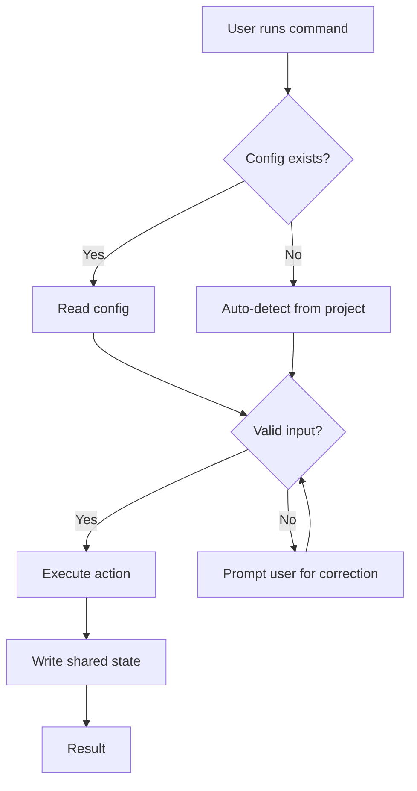
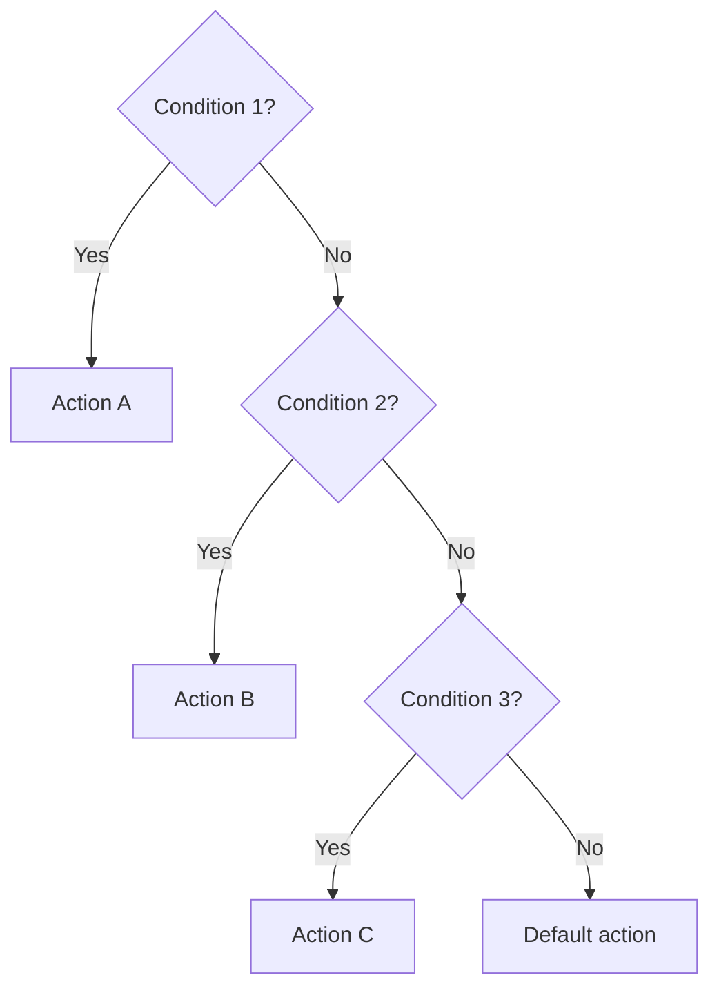

# RFC-NNN: [Title]

| Field       | Value                                    |
| ----------- | ---------------------------------------- |
| **Status**  | Draft / In Review / Approved / Rejected  |
| **Author**  | [Your name or team name]                 |
| **Created** | [Month Year]                             |
| **Links**   | GitHub issues, discussions, or prior RFCs |

## TL;DR

One paragraph summary of the proposed change. What are we doing and why?

## Background

Context needed to understand this RFC. What exists today? Include links to relevant commands, config sections, or prior RFCs.

## Problem

What specific problem are we solving? Why is the current state insufficient?

- **Who is affected?** (command users, contributors, maintainers)
- **How often does this come up?**
- **What happens if we do nothing?**

## Proposed Solution

### Overview

High-level description of the approach.

### Command Flow

Include all decision points where behavior branches based on input, config, or detected state.



### Decision Logic

*Remove this section if not applicable.*

Document each decision point where the command branches based on input, config, or detected state. Use a decision table for 2-3 branches or a mermaid flowchart for complex chains (>3 branches). Include the else/default path -- it's often the most important.

**Decision table format:**

| # | Condition | Signal | Action if True | Action if False |
| - | --------- | ------ | -------------- | --------------- |
| 1 | Config has explicit `branches.feature` pattern | `.claude/config.yaml` | Use configured pattern | Go to #2 |
| 2 | Ticket ID matches Linear format | Ticket argument | Use `feature/{id}-{slug}` | Go to #3 |
| 3 | Default | -- | Use `feature/{id}` | -- |

**Or mermaid flowchart for complex chains:**



### Shared State & Data Contracts

*Remove this section if not applicable.*

Document any shared state this command reads or writes. In this repo, `.pr-context.json` is the primary shared state file: `/start` creates it, `/commit` appends to it, `/tdd` adds test info, and `/finish` reads it.

**Data produced** (fields this command writes):

```jsonc
{
  "fieldName": "string",   // Description of the field
  "anotherField": "number" // Description of the field
}
```

**Data consumed** (fields this command reads):

| Field | Type | Produced by | Fallback if missing |
| ----- | ---- | ----------- | ------------------- |
| `ticketId` | string | `/start` | Prompt user |
| `commits` | array | `/commit` | Read from git log |

### Validation & Detection Rules

*Remove this section if not applicable.*

Document regex patterns, file detection probes, format validation, and similar heuristics.

| Rule Name | Pattern/Heuristic | Input | Valid Example | Invalid Example | Failure Action |
| --------- | ----------------- | ----- | ------------- | --------------- | -------------- |
| Linear ticket format | `^[A-Z]+-\d+$` | Ticket argument | `ENG-123` | `eng123` | Prompt user to re-enter |
| Package manager detection | Check for lockfile | Filesystem | `pnpm-lock.yaml` exists | No lockfile found | Default to `npm` |

### Fallback & Degradation Chains

*Remove this section if not applicable.*

Document ordered fallback chains. Each chain must end with a terminal case that either succeeds with a sensible default or gives the user a clear action.

**Example: Config resolution**

1. Explicit value in `.claude/config.yaml` -> use it
2. Auto-detect from project files (package.json, pyproject.toml) -> use detected value
3. **Terminal:** Use hardcoded default

**Example: Issue tracker**

1. MCP tool available (Linear/Jira) -> fetch ticket details via MCP
2. CLI tool available (`linear`, `jira`) -> fetch via CLI
3. Prompt user for ticket details
4. **Terminal:** Proceed without ticket details, note in PR description

### User Interaction Model

*Remove this section if not applicable.*

Document every point where the command prompts the user for input or confirmation.

| Step | Trigger | Prompt | Options | Default | Skippable (config flag) |
| ---- | ------- | ------ | ------- | ------- | ----------------------- |
| 1 | Branch already exists | "Branch {name} exists. Overwrite?" | Yes / No / Rename | No | -- |
| 2 | Uncommitted changes detected | "Stash changes before switching?" | Yes / No | Yes | `workflow.autoStash` |

### Input Interface

Changes to command arguments and inputs.

| Argument | Format/Pattern | Required? | Source | Default |
| -------- | -------------- | --------- | ------ | ------- |
| `ticket-id` | `[A-Z]+-\d+` | Yes | User argument | -- |
| `branch-type` | `feature\|bugfix\|hotfix` | No | Config / auto-detected | `feature` |

### Output Interface

Changes to config.yaml schema, `.pr-context.json` format, or file outputs.

**Before:**

```yaml
# No existing interface (new command)
```

**After:**

```yaml
# Example: new config.yaml section
newSection:
  enabled: true
  option: value
```

### File Changes

Include shared state files (`.pr-context.json`, `config.yaml`) that are read or written.

| File | Change Type | Description |
| ---- | ----------- | ----------- |
| `.claude/commands/example.md` | New | New slash command |
| `.claude/agents/example.md` | Modified | Updated agent prompt |
| `templates/config.yaml.template` | Modified | Added new section |
| `.pr-context.json` | Write | Adds `newField` to shared state |

### Configuration Changes

Changes to `.claude/config.yaml` schema.

**Before:**

```yaml
# Existing config (if modifying)
```

**After:**

```yaml
# Updated config
```

## Compatibility & Migration

### Backward Compatibility

- Does this break existing commands?
- Does this change config.yaml schema in a non-additive way?
- Does this affect `.pr-context.json` format?
- Does this change the `.pr-context.json` schema or any shared data contract between commands?

### Migration Steps

1. Step-by-step migration instructions (if needed)
2. ...

### Deprecation Timeline

- **v1.x**: Old behavior supported, new behavior available
- **v2.x**: Old behavior removed

## Implementation Plan

### Phase 1: Core Implementation

- [ ] Create/modify files
- [ ] Update documentation
- [ ] Backward compatibility notes

**Rollback:** Revert the commit. No migration needed.

### Phase 2: Integration

- [ ] Update related commands
- [ ] Update examples
- [ ] Update CLAUDE.md

**Rollback:** Revert the commit. Restore previous command versions.

## Risk Assessment

| Risk | Likelihood | Impact | Mitigation |
| ---- | ---------- | ------ | ---------- |
| Cross-command data contract breakage (`.pr-context.json` field renamed/removed) | Low | High | List all consuming commands; add fallback reads for old field names during transition |
| Detection heuristic false positive (e.g., wrong package manager detected) | Medium | Medium | Order probes from most-specific to least-specific; allow explicit config override |
| Fallback chain gap (no terminal case for a degradation path) | Low | High | Require every chain to end with user action or sensible default |
| User interaction confusion (ambiguous prompt or missing default) | Medium | Low | User-test prompts; always provide a default option |

## Key Design Decisions

### Decision 1: [Title]

**Options considered:**

1. **Option A** - Description
2. **Option B** - Description

**Chosen:** Option A because...

### Decision 2: [Title]

**Options considered:**

1. **Option A** - Description
2. **Option B** - Description

**Chosen:** Option B because...

## Success Criteria

- [ ] All existing commands continue to work without config changes
- [ ] New feature works as described in the Proposed Solution
- [ ] Documentation is updated (CLAUDE.md, README.md, relevant docs)
- [ ] Examples are provided for common use cases

## Verification & Testing

| Scenario | Category | Inputs | Expected Path | Expected Output |
| -------- | -------- | ------ | ------------- | --------------- |
| Standard run with config | Happy path | Valid ticket ID, config exists | Config read -> validate -> execute | Branch created, `.pr-context.json` written |
| No config file | Fallback chain | Valid ticket ID, no config | Auto-detect -> defaults | Branch created with default naming |
| Invalid ticket format | Decision branch | `bad-id` | Validation fails -> prompt | User re-prompted for valid ID |
| MCP unavailable | Fallback chain | Valid ticket, no MCP connection | CLI fallback -> prompt fallback | Ticket details from user input |
| Downstream command reads new field | Cross-command | `/finish` reads field added by this RFC | Field present -> used in PR | PR description includes new data |
| Downstream command without new field | Error recovery | `/finish` runs on old `.pr-context.json` | Field missing -> fallback | PR created with fallback value |

## Out of Scope

- Things explicitly NOT included in this RFC
- Future enhancements that could build on this work
- Related but separate concerns

## Open Questions

1. **[Question]** - Context and options being considered
2. **[Question]** - Context and options being considered
